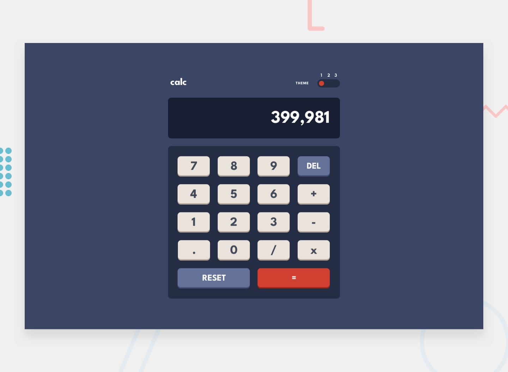

# Frontend Mentor - Calculator app solution

This is a solution to the [Calculator app challenge on Frontend Mentor](https://www.frontendmentor.io/challenges/calculator-app-9lteq5N29). Frontend Mentor challenges help you improve your coding skills by building realistic projects. 

## Table of contents

- [Overview](#overview)
  - [The challenge](#the-challenge)
  - [Screenshot](#screenshot)
  - [Links](#links)
- [My process](#my-process)
  - [Built with](#built-with)
  - [What I learned](#what-i-learned)
  - [My favorite part](#my-favorite-part)
  - [Continued development](#continued-development)
  - [Useful resources](#useful-resources)
  - [AI Collaboration](#ai-collaboration)
- [Author](#author)

## Overview

### The challenge

Users should be able to:

- See the size of the elements adjust based on their device's screen size
- Perform mathmatical operations like addition, subtraction, multiplication, and division
- Adjust the color theme based on their preference

### Screenshot

### Links

- Live Site URL: [Add live site URL here](https://your-live-site-url.com)

## My process

### Built with

- Semantic HTML5 markup
- Flexbox
- CSS Grid
- Mobile-first workflow
- JavaScript
- DOM Manipulation

### What I learned

Working under pressure and really taking my time to not only create a basic calculator but to add complimentary functionalities.

### My favorite part

Storing the result in a variable called `num1`, storing the second number selected in a variable called `numToUse` and operator in a variable called `operatorToUse` as to perform repeated evaluations just using the `=` sign without manually adding numbers. These variables check whether they either have to assign something for the first time, or use the same operator/numbers for further calculations. Only when a new operator or number is selected is when they are newly replaced.

### Continued development

Recreating the same project in React to test my abilities in State and Component based programming.

### Useful resources

- [MDN Web Docs](https://developer.mozilla.org/en-US/)
- [W3Schools](https://www.w3schools.com/)

These websites were very useful in helping me refresh some of the methods and functions I used.

### AI Collaboration

- Claude - I used Claude and ChatGPT only when I had roadblocks and couldn't figure out how to come about solving a specific solution. A Calculator app may seem small compared to large projects, but it felt good to code and design it with no outside code snippet and only using AI for tips or hints.

## Author

- Frontend Mentor - [@justzaid](https://www.frontendmentor.io/profile/justzaid)
